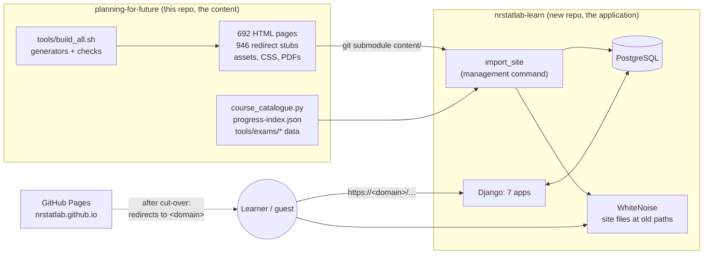
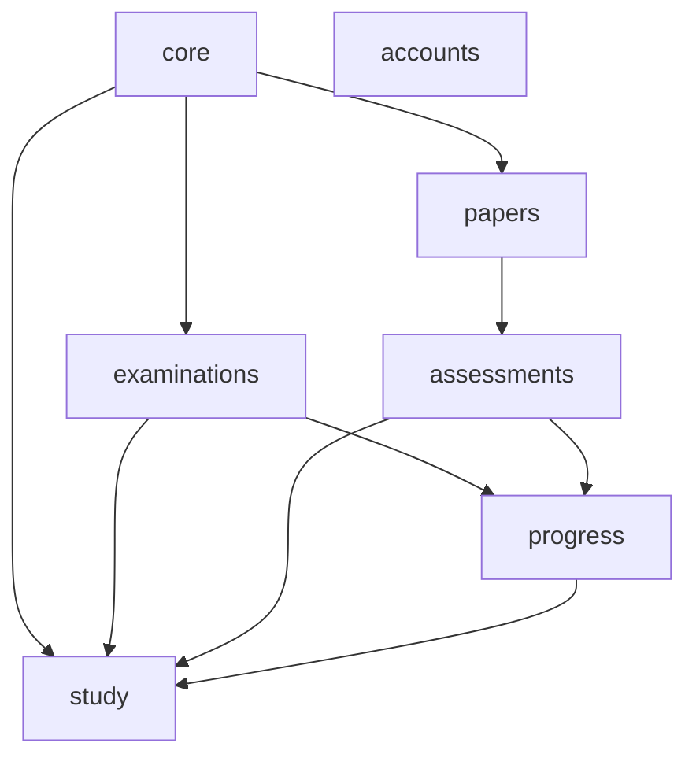
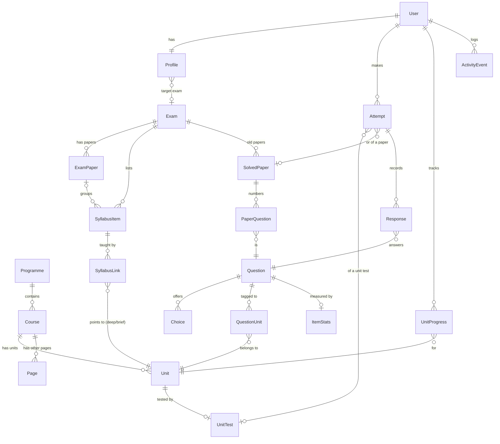
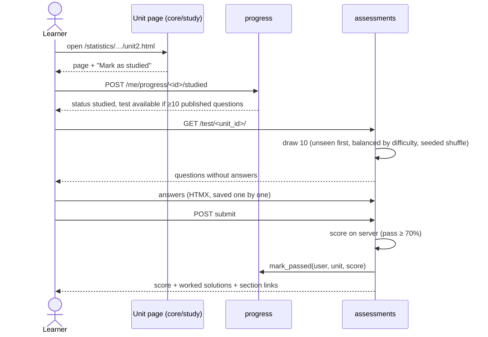

# NRSTATLAB Learn: Phase 0 architecture note

**Status:** Phase 0 deliverable, awaiting approval. **Date:** 26 September 2026.
**Source facts:** this repository at commit `03b9f43`.

This note covers what Phase 0 of [`BUILD-GUIDE.md`](BUILD-GUIDE.md) asks for:
- the decisions;
- the apps and how they depend on each other;
- the entity diagram;
- the URL map;
- the content import;
- the cut-over plan;
- the risks.

No code is written in Phase 0. Phase 1 starts only after this note is approved.

---

## 1. Decisions

Recorded 26 September 2026. These replace the defaults in `PROMPT.md` wherever the two differ.

| # | Decision | Choice | Effect on the build |
|---|---|---|---|
| 1 | Where the code lives | **A new repository, `nrstatlab-learn`**, with this site as a git submodule at `content/` | Server code is never published by GitHub Pages. This site stays the place content is written |
| 2 | Hosting | **A managed platform** with managed PostgreSQL. The provider is chosen in Phase 7 (§9.2) | No server to run at launch. Docker is still used in development so the host can be changed |
| 3 | Google sign-in | **Yes, beside email and password** | allauth's Google provider; one OAuth client is needed before Phase 2 is finished |
| 4 | Learners under 18 | **18 and over only, at launch** | Sign-up asks for confirmation of age 18 or over. Guests of any age read everything. A guardian-consent flow can come later, after legal review |
| 5 | Domain | **Not bought yet.** Written as `<domain>` below | Nothing before Phase 7 depends on it. Buy it before staging goes live |
| 6 | Unit test defaults | **10 questions; pass mark 70%**, both set per test | A pass is 7 of 10. A test opens once its unit has 10 published questions |
| 7 | Email sending | **Decide later** | Development uses Django's console email. A provider is chosen before Phase 2 ends (§9.2) |
| 8 | Question reviewers | **The owner plus one other statistics reviewer** | Two-person rule: an author never approves their own question. The second reviewer must be named before Phase 3 publishes new questions |

---

## 2. The system at a glance

- **Content is written in this repository, exactly as today.** The application pins one content
  commit. A content update is a reviewed pointer change followed by `import_site`.
- **The application renders pages; it does not author them.** Moving authoring into the Django
  admin is a later proposal, not part of this build.

---

## 3. The apps and their boundaries

| App | Owns (writes) | Reads from | Main views |
|---|---|---|---|
| `core` | `Redirect`, site settings | `study`, `examinations`, `papers` (to render any page) | Every legacy path, 404, health, sitemap, robots |
| `accounts` | `User`, `Profile` | — | Sign-up, login (email and Google), profile, privacy, export, delete |
| `study` | `Programme`, `Course`, `Unit`, `Page` | — | Unit and course pages (through `core`) |
| `examinations` | `Exam`, `ExamPaper`, `SyllabusItem`, `SyllabusLink` | `study`, `progress` | Readiness |
| `papers` | `SolvedPaper`, `PaperQuestion` | `assessments` | Practice mode, exam mode, review |
| `assessments` | `Question`, `Choice`, `QuestionUnit`, `UnitTest`, `Attempt`, `Response`, `ItemStats` | `study`, `progress` | Unit test start, answer, submit, results |
| `progress` | `UnitProgress`, `ActivityEvent` | `study` | Mark studied, dashboard, browser import |

**Dependency rules** (a test enforces them from Phase 1):

- **Arrows point from the app that calls to the app that is called.** `study` depends on nothing,
  and nothing depends on `core`.
- **Calls go through `services.py`.** An app never writes another app's tables. `progress` is
  changed only by `mark_studied`, `mark_passed` and `import_browser`.
- **`assessments` calls `progress.services.mark_passed`.** `progress` never imports `assessments`,
  so there are no cycles.
- **Every app depends on `accounts`.** It uses `settings.AUTH_USER_MODEL`, not an import, so
  `accounts` is left out of the graph.

---

## 4. Entity diagram

**Key constraints:**
- `Unit.legacy_path` and `Page.legacy_path` are unique. This path is the page id `progress.js`
  already uses.
- `UnitProgress` is unique on (user, unit).
- `Attempt` must have exactly one of `unit_test` and `paper` (a check constraint).
- `PaperQuestion` is unique on (paper, number).
- `Question.answer` and `Choice.is_correct` are read only in `assessments.services.score()`, and
  are never passed to a template before submission.
- Deleting a user sets `Attempt.user` to null (anonymised, kept for item statistics). It deletes
  `Profile`, `UnitProgress` and `ActivityEvent`.

**The exact fields** are in `PROMPT.md` §4. The only change from there: `UnitTest.pass_mark`
defaults to 70 (decision 6).

---

## 5. URL map

### 5.1 Public pages: every current path, unchanged

The paths come from `sitemap.xml` (675 indexed pages). They are served by one catch-all view in
`core`, and each path returns the same content as today.

| Section | Indexed pages | Examples | Served from |
|---|---|---|---|
| Root | 3 | `/`, `/index.html`, `/about.html`, `/topics.html` | `Page` |
| `statistics/` | 254 | `/statistics/sampling-theory/unit2.html`, `/statistics/economics/unit5.html` | `Unit` (markable) or `Page` |
| `data-science/` | 391 | `/data-science/machine-learning/unit2.html`, lab and program pages | `Unit` or `Page` |
| `exams/` | 26 | `/exams/ugc-net/mcqs.html`, `/exams/iss/paper1.html`, `/exams/appsc/solved-2025-paper-ii.html` | `Page`, with the exam app's extras |
| `guides/` | 1 | `/guides/which-test.html` | `Page` |
| 404 | — | any unknown path | `core` 404 view, with the site's 404 page |

- **Markable pages:** the 310 pages in `assets/progress-index.json`, across 56 courses. Signed-in
  learners see "Mark as studied" on these.
- **Site files** (CSS, JS, images, PDFs, JSON indexes) are served at their current paths by
  WhiteNoise from `var/site_root/`, for example `/assets/site-base.css` and
  `/statistics/economics/css/styles.css`.
- **Redirects:** the 946 stubs become 301 responses. Their old folders are:
  - `data-science-major/`: 408;
  - `statistics-major/`: 241;
  - `statistics/` (flattened BSc paths): 240;
  - `exam-subjects/`: 15;
  - `subjects/`: 15;
  - `ugc-net-statistics/`: 13;
  - others: 14.
- **Generated at request time:** `/sitemap.xml` and `/robots.txt`, both for `<domain>`.

### 5.2 Application routes

None of these ends in `.html`, so none can collide with a content path. The first segment of each
was checked against the repository: no content folder uses `accounts/`, `me/`, `test/`, `papers/`,
`readiness/`, `static/` or `staff/`.

| Path | App | What it does | Who |
|---|---|---|---|
| `/accounts/signup/`, `/accounts/login/`, `/accounts/logout/`, `/accounts/password/reset/`, `/accounts/google/login/` | accounts (allauth) | Sign-up, login and reset; Google sign-in | Anyone |
| `/accounts/confirm-email/<key>/` | accounts | Email verification | Anyone with the link |
| `/me/` | progress | Dashboard | Signed in |
| `/me/profile/`, `/me/privacy/`, `/me/export`, `/me/delete` | accounts | Profile; privacy; JSON export; deletion (asks for the password) | Signed in |
| `POST /me/progress/<unit_id>/studied` | progress | Mark studied (HTMX); returns the button | Signed in |
| `POST /me/progress/import` | progress | Import browser progress `{done: [...]}` | Signed in |
| `/test/<unit_id>/` | assessments | Start, or resume, a unit test | Signed in, unit studied |
| `POST /test/attempt/<attempt_id>/answer` | assessments | Save one response (HTMX) | Owner of the attempt |
| `POST /test/attempt/<attempt_id>/submit` | assessments | Score and freeze the attempt | Owner |
| `/test/attempt/<attempt_id>/result` | assessments | Score, solutions, links to sections | Owner |
| `/papers/<paper_slug>/practice` | papers | One question at a time | Signed in |
| `/papers/<paper_slug>/exam` | papers | Full paper, official rules shown | Signed in |
| `/papers/attempt/<attempt_id>/review` | papers | Review after submission | Owner |
| `/readiness/<exam_slug>/` | examinations | Readiness and the next units | Signed in |
| `/privacy.html` | core | Public privacy page | Anyone |
| `/healthz` | core | Checks the app and the database | Monitoring |
| `/staff/` | Django admin (OTP) | Content review queue, users | Staff with TOTP |
| `/static/…` | Django static | The app's own CSS and JS, self-hosted MathJax | Anyone |

- **Admin path.** The admin sits at `/staff/`, not `/admin/`.
- **Attempt ids** are random UUIDs, not sequential integers. Every view also checks that the
  attempt belongs to `request.user`.

---

## 6. Content import (`import_site`)

**The mapping from source to model:**

| Source (in `content/`) | Becomes | Expected count |
|---|---|---|
| `tools/course_catalogue.py` + `assets/progress-index.json` | `Programme`, `Course` (order, group, level) | 56 courses |
| Indexed HTML listed as markable | `Unit` (head, body, content hash) | 310 |
| Other indexed HTML | `Page` | 365 (675 − 310) |
| HTML stubs (`tools/stubs.py` `is_stub`) | `Redirect` (301) | 946 |
| Every non-HTML file | Copied to `var/site_root/` at the same path | every tracked asset |
| `tools/exams/*_map_data.py` and the CSIR map generator | `Exam`, `ExamPaper`, `SyllabusItem`, `SyllabusLink` | 5 exams; about 600 graded items |
| `exams/ugc-net/mcqs.html` | `Question` and `Choice` (exam bank), unit links | 500 |
| `exams/ugc-net/solved-2026.html` | `SolvedPaper` + 150 `PaperQuestion` | 150 |
| `tools/exams/appsc_paper_2025.json` / `_2022.json` + `_data.py` | 2 `SolvedPaper` + 300 `PaperQuestion`, with the official duration and marking from each paper's header | 150 + 150 |

- **The syllabus-item count** is settled by the importer. The ASRB map alone has 99 items: 60
  deep, 16 brief, 23 not covered. The rechecks already count the UGC NET map's 130 rows.
- **Page splitting.** Each page is split on markers that every page already has:
  - the `<head>`: kept, except that the title, canonical and og:url are rebuilt;
  - `<!-- site-nav -->` … `<!-- /site-nav -->`: dropped, because Django renders the navigation;
  - the body, running from `<!-- /site-nav -->` up to `<footer class="sitefoot">`: kept verbatim.
- **Safety.**
  - The whole import runs in one transaction.
  - `--dry-run` prints the counts without writing anything.
  - Any count that differs from the table above stops the import.
  - A second run with unchanged content changes nothing.

---

## 7. Three key flows

- **Browser import.** On the first signed-in page load, a script reads `nrstatlab.progress.v1`. If
  it holds page ids, it offers to bring them over. It then posts the ids to
  `/me/progress/import`, and the server:
  - keeps only ids that match a markable unit;
  - marks those units studied, never passed;
  - never lowers an existing status;
  - reports how many were imported and how many ignored.
- **Old paper in exam mode.** Before the paper starts, the learner sees the official duration and
  marking scheme, with their source.
  - For APPSC these come from the Commission's paper header and each question's marks line.
  - Where no official rule is recorded, there is no timer and no negative marking.
  - Withdrawn questions (APPSC 2025 Q134; 2022 Q51 and Q81) are shown and left out of both the
    score and the maximum.

---

## 8. Non-functional requirements

| Area | Requirement |
|---|---|
| Security | HTTPS and HSTS; secure, HttpOnly cookies; CSRF; strict CSP with MathJax self-hosted; Argon2; django-axes (lock after 5 failures); OTP on `/staff/`; secrets only in environment variables; `pip-audit` in CI |
| Privacy | Stores email, display name, optional target exam and date, progress and attempts. No phone number, ads or trackers. Self-service export and delete. Age 18 or over at sign-up (decision 4) |
| Accuracy | Answers scored only on the server. Six contested UGC NET keys flagged and never scored. Two-person review (decision 8). Numeric answers recomputed by script |
| Performance | p95 server time under 300 ms on public pages; public pages cached for guests; LCP under 2.5 s on a mid-range phone |
| Accessibility | WCAG AA in both themes (`tools/check_contrast.js`); tests fully usable from the keyboard; no horizontal scroll at 390 px |
| Availability | Health check; uptime monitoring; daily database backups kept 30 days; restore tested before launch and then monthly |
| Compatibility | All 675 indexed paths return 200 with the same text; all 946 old paths return 301 |

---

## 9. Cut-over plan

### 9.1 Stages

| Stage | When | What happens | Rollback |
|---|---|---|---|
| A. Build | Phases 1–6 | The app runs locally and in CI. GitHub Pages stays the live site | — |
| B. Staging | Phase 7 | `staging.<domain>` runs the app. It is password-protected and `noindex`, with fake accounts only | Delete it |
| C. Soft launch | After staging passes every Phase 7 check | `<domain>` is live. GitHub Pages is still live and unchanged, and pages get a small "Sign in to save your progress" link to `<domain>` | Remove the link |
| D. Move | 2–4 weeks after C, if error rates and speed are fine | GitHub Pages is republished as redirect pages: a meta refresh to the same path on `<domain>`, a canonical, `noindex`. The new sitemap goes to the search engines | Republish the previous Pages build, kept as a tagged commit |
| E. Settle | 2 weeks after D | Watch 404s and search traffic, fix any missed paths, and retire the GitHub Pages sign-in link | — |

- **Why a soft launch.** It lets real learners use the app while the proven static site stays
  live. Search traffic moves only once the app has run steadily for weeks.
- **Content keeps being written** in this repository throughout all five stages.

### 9.2 Choices still to settle, and when

| Choice | Settle by | How |
|---|---|---|
| Hosting provider | Start of Phase 7 | Compare two or three managed platforms. Criteria: managed PostgreSQL with backups and restore; a region in or near India; custom domain and TLS; logs; current monthly price |
| Email provider | End of Phase 2 | A transactional service with SPF, DKIM and DMARC on `<domain>`; check deliverability to Gmail and Outlook |
| Domain | Before stage B | Buy it; set up DNS for the app, the staging subdomain and email authentication |
| Second reviewer | Before Phase 3 publishes new questions | Named, with a staff account and TOTP |
| Legal review | Before stage C | Privacy page and terms, checked against India's DPDP Act, 2023 and its Rules |

---

## 10. Risks

| Risk | Likelihood | Impact | Mitigation | Owner |
|---|---|---|---|---|
| Too few questions: about 96 of 153 statistics units have no practice set | High | Medium | Tests open only at 10 published questions. The bank is seeded from about 1,000 keyed questions. Authoring continues course by course | Owner and reviewer |
| A wrong key damages trust | Medium | High | Two-person review; recompute scripts; flagged keys never scored; item analysis; fix within 7 days | Owner |
| The 70% pass mark proves too strict for 10-question tests | Medium | Medium | Watch first-attempt pass rates. The healthy band is 50–80%; adjust per test. It is a setting, not a code change | Owner |
| The importer splits a page wrongly | Medium | Medium | Text comparison against the original for every indexed page in CI; a failing page blocks the import | Developer |
| Search ranking drops at the move | Medium | High | Same paths; 301s and redirect pages with canonicals; the soft launch before the move; the sitemap submitted | Developer |
| Content and app drift apart | Medium | Medium | A pinned submodule; import on deploy; CI runs the content checks against rendered pages | Developer |
| A personal-data incident | Low | High | Minimum data; security settings; OTP admin; backups encrypted; the incident steps in the runbook | Owner |
| Hosting cost grows | Low | Medium | Cache public pages; start small; the VPS option stays open because Docker is used from the start | Owner |
| Google OAuth or email setup delays Phase 2 | Medium | Low | Email and password works alone. Google is added when its client is ready | Developer |

---

## 11. Phase 1 preview (after approval)

1. Create `nrstatlab-learn`, add this repository as the `content/` submodule, and add
   `.gitignore` and `.env.example` (BUILD-GUIDE, Step 1).
2. Create the project and the seven apps, and split the settings (Step 2).
3. Create the custom `User` and `Profile` before the first migration (Step 3).
4. Set up Docker Compose with PostgreSQL 16 (Step 4).
5. Write the `study`, `examinations`, `papers` and `core` models, then `import_site` with
   `--dry-run` and the count checks (Step 5).
6. Add the catch-all page view, the 301 redirects, WhiteNoise at the old paths, the base template
   and the navigation (Step 6).
7. Set up CI: ruff, `manage.py check`, migrations check, import dry run, pytest (every path returns
   200 or 301 with matching text), and the dependency-rule test (§3).

**Done when** all 675 indexed paths return 200 with the same text as today, all 946 old paths
return 301, and CI is green. Then stop for the Phase 1 review.

**Needed from you for Phase 1:** permission to create the `nrstatlab/nrstatlab-learn` repository.
Nothing else from §9.2 is needed until later phases.
