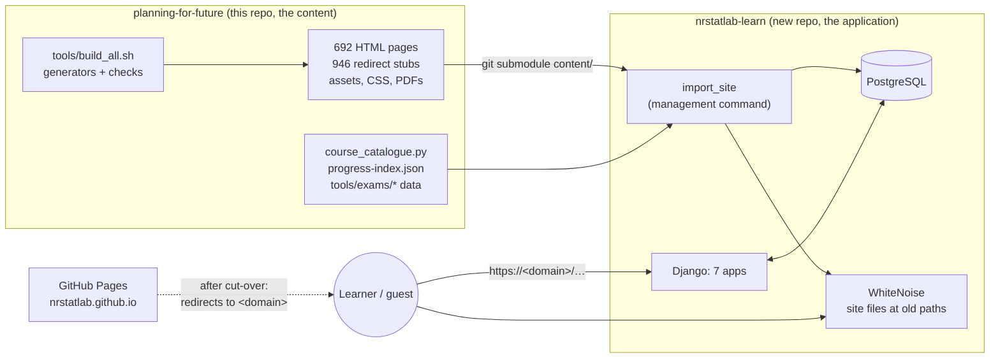
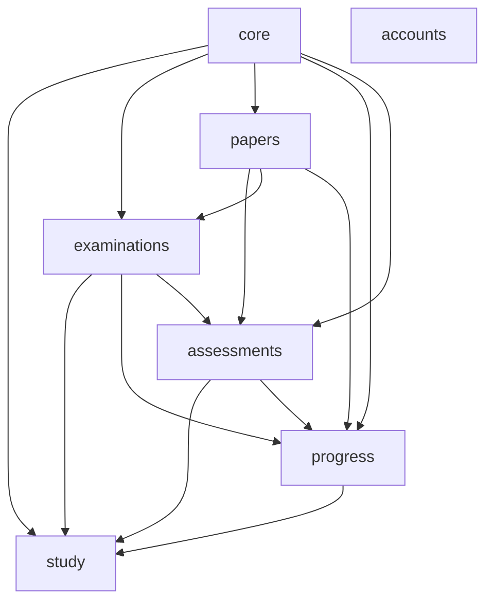
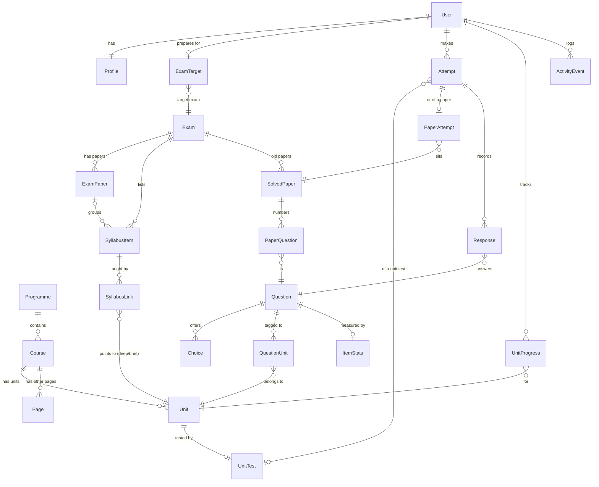
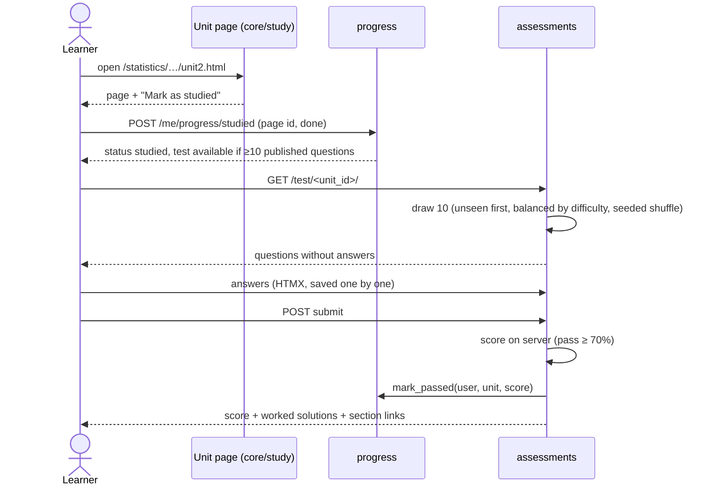

# NRSTATLAB Learn: Phase 0 architecture note

**Status:** Phase 0 deliverable, approved 26 September 2026. It was revised in Phase 1: see §12.
**Date:** 26 September 2026.
**Source facts:** this repository at commit `03b9f43`.

This note covers what Phase 0 of [`BUILD-GUIDE.md`](BUILD-GUIDE.md) asks for:
- the decisions;
- the apps and how they depend on each other;
- the entity diagram;
- the URL map;
- the content import;
- the cut-over plan;
- the risks.

No code is written in Phase 0. Phase 1 starts only after this note is approved.

---

## 1. Decisions

Recorded 26 September 2026. These replace the defaults in `PROMPT.md` wherever the two differ.

| # | Decision | Choice | Effect on the build |
|---|---|---|---|
| 1 | Where the code lives | **A new repository, [`nrstatlab/nrstatlab-learn`](https://github.com/nrstatlab/nrstatlab-learn)**, with this site as a git submodule at `content/`. It is **public, by the owner's choice** (27 September 2026) | Server code is never served by GitHub Pages. This site stays the place content is written. Because the code is public, no secret may ever be committed: settings come only from the environment, `.env` is ignored, and every file and commit was scanned for secrets and personal data before the first push |
| 2 | Hosting | **A managed platform** with managed PostgreSQL. The provider is chosen in Phase 7 (§9.2) | No server to run at launch. Docker is still used in development so the host can be changed |
| 3 | Google sign-in | **Yes, beside email and password** | allauth's Google provider; one OAuth client is needed before Phase 2 is finished |
| 4 | Learners under 18 | **18 and over only, at launch** | Sign-up asks for confirmation of age 18 or over. Guests of any age read everything. A guardian-consent flow can come later, after legal review |
| 5 | Domain | **Not bought yet.** Written as `<domain>` below | Nothing before Phase 7 depends on it. Buy it before staging goes live |
| 6 | Unit test defaults | **10 questions; pass mark 70%**, both set per test | A pass is 7 of 10. A test opens once its unit has 10 published questions |
| 7 | Email sending | **Decide later** | Development uses Django's console email. A provider is chosen before Phase 2 ends (§9.2) |
| 8 | Question reviewers | **The owner plus one other statistics reviewer** | Two-person rule: an author never approves their own question. The second reviewer must be named before Phase 3 publishes new questions |

---

## 2. The system at a glance

```mermaid
flowchart LR
  subgraph content["planning-for-future (this repo, the content)"]
    gen["tools/build_all.sh<br/>generators + checks"] --> tree["692 HTML pages<br/>946 redirect stubs<br/>assets, CSS, PDFs"]
    data["course_catalogue.py<br/>progress-index.json<br/>tools/exams/* data"]
  end
  subgraph learn["nrstatlab-learn (new repo, the application)"]
    imp["import_site<br/>(management command)"]
    dj["Django: 7 apps"]
    db[("PostgreSQL")]
    wn["WhiteNoise<br/>site files at old paths"]
  end
  tree -- "git submodule content/" --> imp
  data --> imp
  imp --> db
  imp --> wn
  dj <--> db
  user(("Learner / guest")) -- "https://&lt;domain&gt;/…" --> dj
  user --> wn
  pages["GitHub Pages<br/>nrstatlab.github.io"] -. "after cut-over:<br/>redirects to &lt;domain&gt;" .-> user
```

- **Content is written in this repository, exactly as today.** The application pins one content
  commit. A content update is a reviewed pointer change followed by `import_site`.
- **The application renders pages; it does not author them.** Moving authoring into the Django
  admin is a later proposal, not part of this build.

---

## 3. The apps and their boundaries

| App | Owns (writes) | Reads from | Main views |
|---|---|---|---|
| `core` | `Redirect`, site settings | `study`, `examinations`, `papers` (to render any page); `progress` (the learner's progress, added to each page); `assessments` (the unit test box) | Every legacy path, 404, health, sitemap, robots, privacy; `import_site`, `import_questions` |
| `accounts` | `User`, `Profile` | — | Sign-up, login (email and Google), export, delete |
| `study` | `Programme`, `Course`, `Unit`, `Page` | — | Unit and course pages (through `core`) |
| `examinations` | `Exam`, `ExamPaper`, `SyllabusItem`, `SyllabusLink`, `ExamTarget` | `study`, `progress`, `assessments` (which units have a test) | Readiness |
| `papers` | `SolvedPaper`, `PaperQuestion`, `PaperAttempt` | `assessments`, `examinations`, `progress` (a paper sat, for the dashboard) | Practice mode, exam mode, review |
| `assessments` | `Question`, `Choice`, `QuestionUnit`, `UnitTest`, `Attempt`, `Response`, `ItemStats` | `study`, `progress` | Unit test start, answer, submit, results |
| `progress` | `UnitProgress`, `ActivityEvent` | `study`, `accounts` (the import flag) | Mark studied, dashboard, browser import |

**Dependency rules** (a test enforces them from Phase 1):

```mermaid
flowchart TB
  core --> study & examinations & papers & progress & assessments
  accounts
  examinations --> study & progress & assessments
  papers --> assessments & examinations & progress
  assessments --> study & progress
  progress --> study
```

- **Arrows point from the app that calls to the app that is called.** `study` depends on nothing,
  and nothing depends on `core`.
- **Calls go through `services.py`.** An app never writes another app's tables. `progress` is
  changed only by `mark_studied`, `record_test`, `record_paper` and `import_browser`.
- **`assessments` calls `progress.services.record_test`** (Phase 3; the plan's `mark_passed`), and
  `papers` calls `progress.services.record_paper` (Phase 4). `progress` imports neither, so there
  are no cycles.
- **Every app may use `accounts`.** Models point at `settings.AUTH_USER_MODEL`, and since Phase 2
  any app may call `accounts.services`: apps add their part of the data export to its registry,
  and `progress` sets the import flag on the profile. `accounts` itself uses no other app, so this
  adds no cycle, and it is left out of the graph.

---

## 4. Entity diagram

```mermaid
erDiagram
  User ||--|| Profile : has
  User ||--o| ExamTarget : "prepares for"
  ExamTarget }o--|| Exam : "target exam"

  Programme ||--o{ Course : contains
  Course ||--o{ Unit : "has units"
  Course ||--o{ Page : "has other pages"

  Exam ||--o{ ExamPaper : "has papers"
  Exam ||--o{ SyllabusItem : lists
  ExamPaper |o--o{ SyllabusItem : groups
  SyllabusItem ||--o{ SyllabusLink : "taught by"
  SyllabusLink }o--|| Unit : "points to (deep/brief)"

  Exam ||--o{ SolvedPaper : "old papers"
  SolvedPaper ||--o{ PaperQuestion : numbers
  PaperQuestion }o--|| Question : is

  Question ||--o{ Choice : offers
  Question ||--o{ QuestionUnit : "tagged to"
  QuestionUnit }o--|| Unit : "belongs to"
  Question ||--o| ItemStats : "measured by"
  Unit ||--o| UnitTest : "tested by"

  User ||--o{ Attempt : makes
  Attempt }o--o| UnitTest : "of a unit test"
  Attempt ||--o| PaperAttempt : "or of a paper"
  PaperAttempt }o--|| SolvedPaper : sits
  Attempt ||--o{ Response : records
  Response }o--|| Question : answers

  User ||--o{ UnitProgress : tracks
  UnitProgress }o--|| Unit : "for"
  User ||--o{ ActivityEvent : logs
```

**Key constraints:**
- `Unit.legacy_path` and `Page.legacy_path` are unique. This path is the page id `progress.js`
  already uses.
- `UnitProgress` is unique on (user, unit).
- `Attempt` must have exactly one of `unit_test` and `paper` (a check constraint).
- `PaperQuestion` is unique on (paper, number).
- `Question.answer` and `Choice.is_correct` are read only in `assessments.services.score()`, and
  are never passed to a template before submission.
- Deleting a user sets `Attempt.user` to null (anonymised, kept for item statistics). It deletes
  `Profile`, `UnitProgress` and `ActivityEvent`.

**The exact fields** are in `PROMPT.md` §4. The only change from there: `UnitTest.pass_mark`
defaults to 70 (decision 6).

---

## 5. URL map

### 5.1 Public pages: every current path, unchanged

The paths come from `sitemap.xml` (675 indexed pages). They are served by one catch-all view in
`core`, and each path returns the same content as today.

| Section | Indexed pages | Examples | Served from |
|---|---|---|---|
| Root | 3 | `/`, `/index.html`, `/about.html`, `/topics.html` | `Page` |
| `statistics/` | 254 | `/statistics/sampling-theory/unit2.html`, `/statistics/economics/unit5.html` | `Unit` (markable) or `Page` |
| `data-science/` | 391 | `/data-science/machine-learning/unit2.html`, lab and program pages | `Unit` or `Page` |
| `exams/` | 26 | `/exams/ugc-net/mcqs.html`, `/exams/iss/paper1.html`, `/exams/appsc/solved-2025-paper-ii.html` | `Page`, with the exam app's extras |
| `guides/` | 1 | `/guides/which-test.html` | `Page` |
| 404 | — | any unknown path | `core` 404 view, with the site's 404 page |

- **Markable pages:** the 310 pages in `assets/progress-index.json`, across 56 courses. Signed-in
  learners see "Mark as studied" on these.
- **Site files** (CSS, JS, images, PDFs, JSON indexes) are served at their current paths by
  WhiteNoise from `var/site_root/`, for example `/assets/site-base.css` and
  `/statistics/economics/css/styles.css`.
- **Redirects:** the 946 stubs become 301 responses. Their old folders are:
  - `data-science-major/`: 408;
  - `statistics-major/`: 241;
  - `statistics/` (flattened BSc paths): 240;
  - `exam-subjects/`: 15;
  - `subjects/`: 15;
  - `ugc-net-statistics/`: 13;
  - others: 14.
- **Generated at request time:** `/sitemap.xml` and `/robots.txt`, both for `<domain>`.

### 5.2 Application routes

None of these ends in `.html` except `/privacy.html`, which the site does not have (a test checks it), so none can collide with a content path. The first segment of each
was checked against the repository: no content folder uses `accounts/`, `me/`, `test/`, `papers/`,
`readiness/`, `static/` or `staff/`.

| Path | App | What it does | Who |
|---|---|---|---|
| `/accounts/signup/`, `/accounts/login/`, `/accounts/logout/`, `/accounts/password/reset/`, `/accounts/google/login/` | accounts (allauth) | Sign-up, login and reset; Google sign-in | Anyone |
| `/accounts/confirm-email/<key>/` | accounts | Email verification | Anyone with the link |
| `/me/` | progress | Dashboard | Signed in |
| `/accounts/email/`, `/accounts/password/change/` | accounts (allauth) | Change the email address or the password | Signed in |
| `/me/export`, `/me/delete` | accounts | JSON export; deletion (asks for the password, or DELETE for a Google-only account) | Signed in |
| `POST /me/progress/studied` | progress | Mark a unit studied or not: JSON `{"page": <page id>, "done": true or false}`; returns the new status | Signed in |
| `POST /me/progress/import`, `POST /me/progress/import/dismiss` | progress | Import browser progress `{done: [...]}`; or decline it ("Not now") | Signed in |
| `/test/<unit_id>/`, `POST /test/<unit_id>/start` | assessments | The test's page; start, or resume, a unit test | Signed in, unit studied |
| `POST /test/attempt/<attempt_id>/answer` | assessments | Save one response (JSON `{"question": n, "answer": …}`) | Owner of the attempt |
| `POST /test/attempt/<attempt_id>/submit` | assessments | Score and freeze the attempt | Owner |
| `/test/attempt/<attempt_id>/result` | assessments | Score, solutions, links to sections | Owner |
| `/papers/` | papers | The solved papers, with the learner's last result for each | Signed in |
| `/papers/<paper_slug>/`, `POST /papers/<paper_slug>/start` | papers | The paper's rules, from its header; start, or resume, practice or an exam | Signed in |
| `/papers/attempt/<attempt_id>/` | papers | Exam: the whole paper, with the clock where the header records a duration. Practice: one question (`?q=n`) | Owner |
| `POST /papers/attempt/<attempt_id>/answer`, `…/check`, `…/reveal` | papers | Save one answer (JSON); practice: check it and show the key and working (a form post, or JSON) | Owner |
| `POST /papers/attempt/<attempt_id>/submit` | papers | Score and freeze | Owner |
| `/papers/attempt/<attempt_id>/review` | papers | Review after submission | Owner |
| `/readiness/` | examinations | The five exams, with the learner's readiness for each | Signed in |
| `/readiness/<exam_slug>/`, `POST /readiness/<exam_slug>/target` | examinations | Readiness line by line, and the next units; make it my exam, or stop | Signed in |
| `/privacy.html` | core | Public privacy page | Anyone |
| `/healthz` | core | Checks the app and the database | Monitoring |
| `/staff/` | Django admin (OTP) | Users; questions; **Questions in the review queue** (`/staff/assessments/reviewquestion/`: draft and flagged questions, each with a side-by-side review page, Approve and Send back) | Staff with TOTP; the review queue for members of "Reviewers" |
| `/static/…` | Django static | The app's own CSS and JS, self-hosted MathJax | Anyone |

- **Admin path.** The admin sits at `/staff/`, not `/admin/`.
- **Attempt ids** are random UUIDs, not sequential integers. Every view also checks that the
  attempt belongs to `request.user`.

---

## 6. Content import (`import_site`)

**The mapping from source to model:**

| Source (in `content/`) | Becomes | Expected count |
|---|---|---|
| `tools/course_catalogue.py` + `assets/progress-index.json` | `Programme`, `Course` (order, group, level) | 56 courses |
| Indexed HTML listed as markable | `Unit` (head, body, content hash) | 310 |
| Other indexed HTML | `Page` | 365 (675 − 310) |
| HTML stubs (`tools/stubs.py` `is_stub`) | `Redirect` (301) | 946 |
| Every non-HTML file | Copied to `var/site_root/` at the same path | every tracked asset |
| `tools/exams/*_map_data.py` and the CSIR map generator | `Exam`, `ExamPaper`, `SyllabusItem`, `SyllabusLink` | 5 exams; about 600 graded items |
| `exams/ugc-net/mcqs.html` | `Question` and `Choice` (exam bank), unit links | 500 |
| `exams/ugc-net/solved-2026.html` | `SolvedPaper` + 150 `PaperQuestion` | 150 |
| `tools/exams/appsc_paper_2025.json` / `_2022.json` + `_data.py` | 2 `SolvedPaper` + 300 `PaperQuestion`, with the official duration and marking from each paper's header | 150 + 150 |

- **The syllabus-item count** is settled by the importer. The ASRB map alone has 99 items: 60
  deep, 16 brief, 23 not covered. The rechecks already count the UGC NET map's 130 rows.
- **Page splitting.** Each page is split on markers that every page already has:
  - the `<head>`: kept, except that the title, canonical and og:url are rebuilt;
  - `<!-- site-nav -->` … `<!-- /site-nav -->`: dropped, because Django renders the navigation;
  - the body, running from `<!-- /site-nav -->` up to `<footer class="sitefoot">`: kept verbatim.
- **Safety.**
  - The whole import runs in one transaction.
  - `--dry-run` prints the counts without writing anything.
  - Any count that differs from the table above stops the import.
  - A second run with unchanged content changes nothing.

---

## 7. Three key flows

```mermaid
sequenceDiagram
  actor L as Learner
  participant U as Unit page (core/study)
  participant P as progress
  participant A as assessments
  L->>U: open /statistics/…/unit2.html
  U-->>L: page + "Mark as studied"
  L->>P: POST /me/progress/studied (page id, done)
  P-->>L: status studied, test available if ≥10 published questions
  L->>A: GET /test/<unit_id>/
  A->>A: draw 10 (unseen first, balanced by difficulty, seeded shuffle)
  A-->>L: questions without answers
  L->>A: answers (HTMX, saved one by one)
  L->>A: POST submit
  A->>A: score on server (pass ≥ 70%)
  A->>P: mark_passed(user, unit, score)
  A-->>L: score + worked solutions + section links
```

- **Browser import.** On the first signed-in page load in a browser, `learn.js` sets aside what
  `nrstatlab.progress.v1` held. If it holds page ids the account does not have, it offers to bring
  them over, once per account. It then posts the ids to `/me/progress/import`, and the server:
  - keeps only ids that match a markable unit;
  - marks those units studied, never passed;
  - never lowers an existing status;
  - reports how many were imported and how many ignored.
- **Old paper in exam mode.** Before the paper starts, the learner sees the official duration and
  marking scheme, with their source.
  - For APPSC these come from the Commission's paper header and each question's marks line.
  - Where no official rule is recorded, there is no timer and no negative marking.
  - Withdrawn questions (APPSC 2025 Q134; 2022 Q51 and Q81) are shown and left out of both the
    score and the maximum.

---

## 8. Non-functional requirements

| Area | Requirement |
|---|---|
| Security | HTTPS and HSTS; secure, HttpOnly cookies; CSRF; strict CSP with MathJax self-hosted; Argon2; django-axes (lock after 5 failures); OTP on `/staff/`; secrets only in environment variables; `pip-audit` in CI |
| Privacy | Stores email, display name, optional target exam and date, progress and attempts. No phone number, ads or trackers. Self-service export and delete. Age 18 or over at sign-up (decision 4) |
| Accuracy | Answers scored only on the server. Six contested UGC NET keys flagged and never scored. Two-person review (decision 8). Numeric answers recomputed by script |
| Performance | p95 server time under 300 ms on public pages; public pages cached for guests; LCP under 2.5 s on a mid-range phone |
| Accessibility | WCAG AA in both themes (`tools/check_contrast.js`); tests fully usable from the keyboard; no horizontal scroll at 390 px |
| Availability | Health check; uptime monitoring; daily database backups kept 30 days; restore tested before launch and then monthly |
| Compatibility | All 675 indexed paths return 200 with the same text; all 946 old paths return 301 |

---

## 9. Cut-over plan

**Offline until sign-off** (the owner's rule, 27 September 2026). The platform is built and checked
on a computer only, until it is complete and its functionality is satisfactory.
- Until the owner signs off every check in the application repository's `docs/LOCAL-CHECK.md`,
  there is no hosting, no staging address, no DNS and no link from the live site.
- Each phase adds its checks to that list.
- Stage B below begins only after that sign-off.

### 9.1 Stages

| Stage | When | What happens | Rollback |
|---|---|---|---|
| A. Build | Phases 1–6 | The app runs locally and in CI. GitHub Pages stays the live site | — |
| B. Staging | Phase 7, after the owner signs off `docs/LOCAL-CHECK.md` | `staging.<domain>` runs the app. It is password-protected and `noindex`, with fake accounts only | Delete it |
| C. Soft launch | After staging passes every Phase 7 check | `<domain>` is live. GitHub Pages is still live and unchanged, and pages get a small "Sign in to save your progress" link to `<domain>` | Remove the link |
| D. Move | 2–4 weeks after C, if error rates and speed are fine | GitHub Pages is republished as redirect pages: a meta refresh to the same path on `<domain>`, a canonical, `noindex`. The new sitemap goes to the search engines | Republish the previous Pages build, kept as a tagged commit |
| E. Settle | 2 weeks after D | Watch 404s and search traffic, fix any missed paths, and retire the GitHub Pages sign-in link | — |

- **Why a soft launch.** It lets real learners use the app while the proven static site stays
  live. Search traffic moves only once the app has run steadily for weeks.
- **Content keeps being written** in this repository throughout all five stages.

### 9.2 Choices still to settle, and when

| Choice | Settle by | How |
|---|---|---|
| Hosting provider | Start of Phase 7 | Compare two or three managed platforms. Criteria: managed PostgreSQL with backups and restore; a region in or near India; custom domain and TLS; logs; current monthly price |
| Email provider | Before staging (Phase 7); moved from the end of Phase 2 | A transactional service with SPF, DKIM and DMARC on `<domain>`; check deliverability to Gmail and Outlook. The code already sends through any SMTP service named by `EMAIL_URL`, so nothing else changes |
| Google OAuth client | Before staging (Phase 7) | Made in the owner's Google Cloud account for `<domain>`, with its redirect URL. Sign-in with Google appears once `GOOGLE_CLIENT_ID` and `GOOGLE_CLIENT_SECRET` are set |
| Domain | Before stage B | Buy it; set up DNS for the app, the staging subdomain and email authentication |
| Second reviewer | Before Phase 3 publishes new questions | Named, with a staff account and TOTP |
| Legal review | Before stage C | Privacy page and terms, checked against India's DPDP Act, 2023 and its Rules |

---

## 10. Risks

| Risk | Likelihood | Impact | Mitigation | Owner |
|---|---|---|---|---|
| Too few questions: about 96 of 153 statistics units have no practice set | High | Medium | Tests open only at 10 published questions. The bank is seeded from about 1,000 keyed questions. Authoring continues course by course | Owner and reviewer |
| A wrong key damages trust | Medium | High | Two-person review; recompute scripts; flagged keys never scored; item analysis; fix within 7 days | Owner |
| The 70% pass mark proves too strict for 10-question tests | Medium | Medium | Watch first-attempt pass rates. The healthy band is 50–80%; adjust per test. It is a setting, not a code change | Owner |
| The importer splits a page wrongly | Medium | Medium | Text comparison against the original for every indexed page in CI; a failing page blocks the import | Developer |
| Search ranking drops at the move | Medium | High | Same paths; 301s and redirect pages with canonicals; the soft launch before the move; the sitemap submitted | Developer |
| Content and app drift apart | Medium | Medium | A pinned submodule; import on deploy; CI runs the content checks against rendered pages | Developer |
| A personal-data incident | Low | High | Minimum data; security settings; OTP admin; backups encrypted; the incident steps in the runbook | Owner |
| Hosting cost grows | Low | Medium | Cache public pages; start small; the VPS option stays open because Docker is used from the start | Owner |
| Google OAuth or email setup delays Phase 2 | Medium | Low | Email and password works alone. Google is added when its client is ready | Developer |

---

## 11. Phase 1 preview (after approval)

1. Create `nrstatlab-learn`, add this repository as the `content/` submodule, and add
   `.gitignore` and `.env.example` (BUILD-GUIDE, Step 1).
2. Create the project and the seven apps, and split the settings (Step 2).
3. Create the custom `User` and `Profile` before the first migration (Step 3).
4. Set up Docker Compose with PostgreSQL 16 (Step 4).
5. Write the `study`, `examinations`, `papers` and `core` models, then `import_site` with
   `--dry-run` and the count checks (Step 5).
6. Add the catch-all page view, the 301 redirects, WhiteNoise at the old paths, the base template
   and the navigation (Step 6).
7. Set up CI: ruff, `manage.py check`, migrations check, import dry run, pytest (every path returns
   200 or 301 with matching text), and the dependency-rule test (§3).

**Done when** all 675 indexed paths return 200 with the same text as today, all 946 old paths
return 301, and CI is green. Then stop for the Phase 1 review.

**Needed from you for Phase 1:** permission to create the `nrstatlab/nrstatlab-learn` repository.
Nothing else from §9.2 is needed until later phases.

---

## 12. Revisions made in Phase 1

These are the refinements Phase 0 invited, made while the models and the importer were written.
They are recorded in the application repository's `docs/PHASE-1-REPORT.md`.

- **`ExamTarget` replaces `Profile.target_exam` and `exam_date`.** The exam a learner prepares for
  lives in `examinations`, so `accounts` depends on no other app.
- **`PaperAttempt` links an `Attempt` to its `SolvedPaper`.** `assessments` therefore never imports
  `papers`. The check constraint on `Attempt` now reads: a unit-test attempt has a `UnitTest`, and a
  paper attempt does not.
- **`papers → examinations` is added to the dependency graph,** because a solved paper belongs to an
  exam.
- **The importer lives in `core`.** Each app stores its own tables through its `services`
  (`study.store_site`, `examinations.store_exams`). The dependency test caught the first version,
  which wrote other apps' tables from `study`.
- **Pages are stored in exact parts, and the navigation is kept verbatim.** The parts are the head,
  the site-nav block, the body, the site-foot block, and the text between them. Every page is
  served byte-identical to the original. Phase 2 adds the account link to the stored navigation,
  instead of re-rendering the navigation from `site_nav_model`.
- **The question bank and the syllabus maps** are imported in Phase 3 and Phase 5, the phases that
  use them. Phase 1 imports courses, units, pages, redirects, exams and site files.
- **The 18 pages outside the sitemap** (16 lab demos, `404.html`, one archive page) are imported and
  served, because today's site serves them.

---

## 13. Revisions made in Phase 2

Recorded in the application repository's `docs/PHASE-2-REPORT.md`.

- **The site's own progress script is reused.** `assets/progress.js` already draws every mark (the
  unit toggles, the ticks on course homes, the home-page totals) from one browser entry. For a
  signed-in learner, `learn.js` writes the account's progress into that entry before
  `progress.js` runs, and sends each toggle to the server. Nothing was rewritten in Django, and the
  content repository is unchanged.
- **Two fragments are added to served pages,** each between `<!-- nrstat-learn -->` markers: the
  account link at the end of the site bar, and the account state with `learn.js` in `<head>`. With
  the fragments removed, every page is still byte-identical to the original, for guests and for
  learners.
- **The "mark studied" route is `POST /me/progress/studied`,** with the page id in the JSON body,
  instead of `/me/progress/<unit_id>/studied` with HTMX. The button belongs to `progress.js`, which
  knows the page id, not a database id.
- **The dependency graph gains `core → progress`,** and every app may use `accounts.services`.
- **The data export is a registry.** Each app registers its part in `accounts.services`, so
  `accounts` never imports another app.
- **Signing out gives a shared browser back to its guest.** The progress the browser held before
  the first sign-in is restored, so the next person never sees the last learner's progress.
- **Two choices move to before staging:** the email provider and the Google OAuth client (§9.2).

---

## 14. Revisions made in Phase 3

Recorded in the application repository's `docs/PHASE-3-REPORT.md`.

- **The question bank is read by `import_questions`**, after `import_site`. The APPSC papers are read
  through the site's own generator, so each question is stored exactly as its solved page shows it.
  The UGC NET June 2026 paper names no unit for its questions, so they stay in the exam bank.
- **A question is flagged, and never scored, when the site doubts its key:** the audit's six, every
  question with a warning note on its solved page, and the three the Commission withdrew. A status
  the owner sets in the admin survives re-imports until the source edits the question.
- **The solved papers are imported in Phase 3,** because their withdrawn questions are marked on
  them. Practice and exam mode stay in Phase 4.
- **`progress.services.record_test` replaces `mark_passed`.** It is called for every submitted test:
  it keeps the best score, a pass marks the unit passed, and the test is recorded for the dashboard
  and the streak. So `progress` shows recent tests without importing `assessments`.
- **Answers are saved with a small script and JSON, not HTMX,** and a plain form posts them too, so
  a test works without script.
- **Options are named by tokens made for each attempt,** not by their labels. The source order of
  the options is itself a clue: of the 500 UGC NET MCQs, 262 keys are A.
- **The dependency graph gains `core → assessments`,** for the test box on unit pages.

---

## 15. Revisions made in Phase 4

Recorded in the application repository's `docs/PHASE-4-REPORT.md`.

- **The routes are as built in §5.2.** A paper's page states its rules and offers practice or an
  exam, rather than separate `/practice` and `/exam` addresses. Practice works without script:
  **Check my answer** and **Show the solution** are form posts, and there is a JSON `reveal` too.
- **A paper runs only under what its header records.** The two APPSC papers: 150 minutes, +1 and
  −0.33. The UGC NET June 2026 page records neither, so it has no clock and takes nothing off, and
  its rules page says so.
- **Withdrawn questions, and questions whose key the site doubts, count neither for nor against**
  (the owner's decision). What did not count is stored with each sitting at submission, so a review
  never changes afterwards; a key the owner settles in the admin counts from the next submission.
- **The clock is a deadline fixed at the start** of an exam. Answers are refused 30 seconds after
  it, and a late submission scores only what was saved in time.
- **`assessments` gains `grade` and `close`,** in place of the planned `mark`, and unit-test
  `submit` is rebuilt on them, so both kinds of attempt share one scoring core. A paper keeps its
  printed option order and labels; options are still named by per-attempt tokens.
- **The dependency graph gains `papers → progress`,** for `record_paper`: the dashboard lists the
  papers sat, and a paper sat counts towards the day streak.

---

## 16. Revisions made in Phase 5

Recorded in the application repository's `docs/PHASE-5-REPORT.md`.

- **`import_site` reads the five syllabus maps through the content repository's own generators**
  (`iss_map`, `asrb_map`, `ugc_map`, `appsc_map`, `csirmap`), from the row functions that print the map
  pages. So the wording and grades are the maps' own. There are 501 lines. Links are followed through
  redirect stubs, and no migration was needed.
- **Only passed units count** (the owner's decision), as Step 12 says. Every readiness figure is shown
  with the most that can be reached today, since only 19 units have a unit test.
- **Link depth.** A UGC NET line's link to the UGC NET unit is brief, and to a checked course unit
  deep. The other maps grade each line, and its links take that grade.
- **Lines left out of the figure are listed plainly:**
  - 16 lines taught only on pages with nothing to mark;
  - 58 lines not taught here.
- **The dependency graph gains `examinations → assessments`,** for which units have a test.
  `progress` gains a card registry, like the export registry, so the dashboard shows the readiness
  card without `progress` importing `examinations`.
- **Page titles are stored as text** (unescaped), and exams are named as the site's menu names them.

---

## 17. Revisions made in Phase 6

Recorded in the application repository's `docs/PHASE-6-REPORT.md`.

- **Item analysis** is `manage.py item_stats`. It gives p and the point-biserial r_pb for each
  question with 30 or more responses.
  - The owner's decisions: only unit tests and exam-mode papers count (not practice), and the
    rest-score is the share of the sitting's other counted answers that are right, so short and long
    sittings are on one scale.
  - A published question is flagged when r_pb < 0, p > 0.95 or p < 0.10, and the "Reviewers" group is
    emailed. An approved question is flagged again only on 30 more responses (`ItemStats.cleared_at_n`).
  - No scheduler library was added: the hosting runs the command nightly (Phase 7).
- **History is a small audit table** (`QuestionEvent`) rather than `django-simple-history`. It records
  imports, changes in the source, retirements, flags by the statistics, approvals, send-backs and every
  admin edit.
- **The review queue** is a proxy of `Question` in the admin:
  - **Approve** publishes and records the reviewer. It is refused to the question's author (decision
    8), and to a question with no key.
  - **Send back** needs a note.
  - Publishing by editing the status on the plain Questions page is refused, so the two-person rule
    cannot be stepped around.
- **Reviewers** are a group, created by a migration. Membership, not the superuser flag, is what the
  second reviewer needs.
