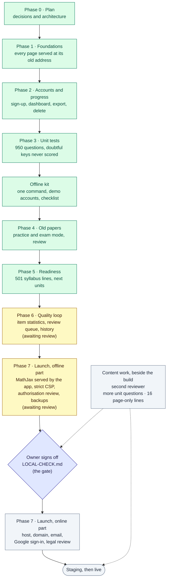

# NRSTATLAB Learn: where the project stands

**1 October 2026.** By NRSTATLAB. Questions and corrections: GitHub Issues.

## What it is

- **The site stays where content is written.** This repository, published on GitHub Pages, keeps
  every page, generator and check.
- **The application is `nrstatlab-learn`**, in Django with PostgreSQL. It serves every page of this
  site at its old address, and adds:
  - accounts and progress;
  - unit tests;
  - old papers, practised or sat as exams;
  - readiness for an exam;
  - a quality loop for the questions.
- **It is offline only.** Nothing of it is online until the owner has signed off every check in
  `docs/LOCAL-CHECK.md` (in `nrstatlab-learn`).

## The flowchart

Green is done, yellow is built and awaiting your review, blue is the gate, and grey is still to do.

## Done so far

| Stage | What it gives | Checked by |
|---|---|---|
| Phase 0, plan | Decisions, architecture, build guide (`Webapp/`) | Approved |
| Phase 1, foundations | All **693 pages** served by the app, byte for byte, and **946 old addresses** redirected | Approved; CI |
| Phase 2, accounts and progress | Sign-up with email confirmation, progress on the account (with browser progress brought over), dashboard, data export and account deletion | Approved; CI |
| Phase 3, unit tests | **950 questions** imported; 10-question unit tests on 19 units (20 since 2 October); doubtful keys never scored | Approved; CI |
| Offline kit | `docker compose up --build`, demo accounts, and the offline checklist | 27 checks at the time |
| Phase 4, old papers | 3 solved papers (**450 questions**), practised or sat as exams under each paper's own rules, with a review by section | Approved; CI |
| Phase 5, readiness | **501 syllabus lines** from the 5 exam maps; readiness from units passed, the most reachable today, and the next three units | Approved; CI |
| Phase 6, quality loop | Nightly p and r_pb per question; bad questions flagged; a review queue with the two-person rule; a history of every change | **Awaiting your review**; CI run #14 green |
| UGC NET Paper I, batch 1 | The General Paper's official syllabus mapped (71 lines); notes for Units I–IV and **80 model MCQs**, with an independent check (720 checks, 0 failures; 17/17 mutations caught); the app reads a Paper I unit only once its heading carries your approval date | **Awaiting your review** on the batch 1 review page; not live yet |
| Phase 7, launch, the offline part | MathJax served by the app, so formulas draw offline; a strict Content Security Policy on every page; production logging and a 500 page; every id route checked for its owner; backup and restore; `pip-audit` and a coverage gate in CI; the host's steps written down (`docs/DEPLOY.md`) | **Awaiting your review**; CI run #18 green |

**Today:**
- **the review queue is closed:** you settled all 37 questions on 2 October 2026, so every keyed
  question is scored (APPSC 2025 Q134, which has no correct option, counts for no one);
- **243 automated tests** pass (96% coverage);
- **55 of 55 offline checks** pass on a fresh Docker setup;
- all 693 pages, and the app's own, open in a browser with no internet and **0 security-policy
  violations**;
- the content repository is untouched by the app.

## Still to do

**Yours: decisions and content.** The platform works without these, but they decide what learners
get.
1. **Review Phases 6 and 7**, then sign off `docs/LOCAL-CHECK.md`, check by check.
2. **Approve UGC NET Paper I** batch by batch on its review pages: batch 1 by 17 October, batch 2
   (Units V–VII) by 27 October, batch 3 (Units VIII–X) by 6 November. Each goes live once approved.
3. **Name the second reviewer:** a staff account, TOTP, and membership of "Reviewers".
4. **Write more unit questions.** Only 20 of the 310 units have a test. That limits readiness today:
   UGC NET 50.8%, CSIR NET 56.4%, APPSC 41.8%, ISS 9.5% and ASRB NET 2.1%.
5. **Point the 16 page-only syllabus lines at units**, where one teaches the line.
6. **Name an official source** if UGC NET June 2026 is to have a timer or negative marking.

**The build: Phase 7, the online part.** Each step waits for a choice of yours; `docs/DEPLOY.md` in
`nrstatlab-learn` has what each one needs.
1. **Choose:**
   - the host (a managed platform with managed PostgreSQL, daily backups and a scheduler);
   - the domain;
   - the email provider;
   - the Google sign-in client.
2. **A legal review** of the privacy page and the 18-and-over rule (India's DPDP Act, 2023).
3. **Staging first:** the release steps, the checklist walked there, and a restore test.
4. **Then live.** Only then does the live site link to the app.

## Running it on an offline laptop

**Install once:** [Docker Desktop](https://www.docker.com/products/docker-desktop/) and
[git](https://git-scm.com/downloads).

**The laptop needs:**
- about 2 GB of free disk. The two images take about 1.4 GB (web 519 MB, `postgres:16` 642 MB, sharing
  some layers), and the database about 80 MB;
- 4 GB of RAM or more, which Docker Desktop itself needs to run comfortably.

**Internet is needed only once,** to download the code and build the images. After that everything
runs with no connection, formulas included.

The one exception is four lab and notes pages whose demonstrations load an outside library (Mermaid,
Prism, jQuery, one font). Offline, those demonstrations don't run; the rest of each page does.

| To | Run |
|---|---|
| Get the code | `git clone --recurse-submodules https://github.com/nrstatlab/nrstatlab-learn.git` |
| Start (the first time takes a few minutes) | `cd nrstatlab-learn` then `docker compose up --build` |
| Use it | open **http://localhost:8000** |
| Stop | Ctrl+C, or `docker compose down` |
| Start again from nothing | `docker compose down -v`, then `docker compose up --build` |
| Get a newer version | `git pull --recurse-submodules`, then `docker compose up --build` |
| Run the item statistics | `docker compose exec web python manage.py item_stats` |
| Back up the database | `docker compose exec db pg_dump -U nrstatlab -Fc -f /backups/nrstatlab.dump nrstatlab` (it lands in the `backups` folder) |
| Restore it | `docker compose stop web`, then `docker compose exec db pg_restore -U nrstatlab -d nrstatlab --clean --if-exists /backups/nrstatlab.dump`, then `docker compose start web` |
| See what the database holds | `docker compose exec web python manage.py data_counts` |

**The demo accounts** (password `local-check-only` for all four):

| Account | What it is for |
|---|---|
| `owner@localhost` | You: the admin at http://localhost:8000/staff/, and a reviewer |
| `reviewer@localhost` | A second reviewer, for the two-person rule |
| `new.learner@localhost` | A learner who has done nothing yet |
| `progress.learner@localhost` | A learner with progress, a passed and a failed test, a paper sat, and UGC NET as their exam |

**Emails** (sign-up, password reset, the reviewers' alerts) are not sent anywhere. They are printed in
the terminal that ran the command.

**Without Docker:** with Python 3.12 and PostgreSQL 16, follow "Run it locally" in the app's
`README.md`, then run `python manage.py setup_local` and `python manage.py runserver`.

The full guide, with every check to tick, is `docs/LOCAL-CHECK.md` in `nrstatlab-learn`. Each phase's
report is `docs/PHASE-N-REPORT.md` there, and Phase 7's offline part is
`docs/PHASE-7-OFFLINE-REPORT.md`.
