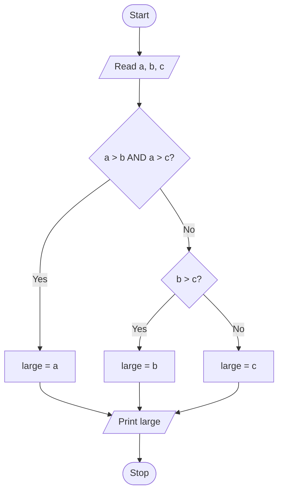

# Unit 1 — Introduction to Computer Programming

**Syllabus topics:** Introduction, types of software, compiler and
interpreter, machine/assembly/high-level programming, flowcharts and
algorithms. Fundamentals of C: history, features, C tokens — variables,
keywords, identifiers, constants and data types, rules for constructing
variable names, operators, structure of a C program, formatted and unformatted
I/O.

---

## 1.1 Types of software

**System software** runs the machine: operating systems, device drivers,
compilers, assemblers, linkers, loaders. **Application software** does the work
you actually wanted: browsers, spreadsheets, this repository's code.

A third category worth naming is **utility software** — antivirus, disk
defragmenters, backup tools — which sits between the two.

## 1.2 Compiler vs interpreter

The single most reliable two-mark question in this unit.

| | Compiler | Interpreter |
|---|---|---|
| Translates | Whole program at once | One statement at a time |
| Output | A separate executable file | Nothing stored; executes directly |
| Speed of execution | Faster | Slower |
| Speed of development | Slower (recompile each change) | Faster |
| Error reporting | All errors after one full pass | Stops at the first error |
| Memory | Needs space for the object code | Needs less |
| Examples | C, C++, Rust | Python, JavaScript, BASIC |

C uses a compiler. That is why you must compile before you run, and why the
compiler catches type mistakes that Python only discovers when the line
executes.

**Not examined but worth knowing:** Python is compiled to bytecode and then
interpreted, and Java compiles to bytecode run by a JIT. The clean split above
is a simplification the exam expects.

## 1.3 Levels of programming language

| Level | What it looks like | Portable? |
|---|---|---|
| **Machine language** | Binary: `10110000 01100001` | No — tied to the CPU |
| **Assembly language** | Mnemonics: `MOV AL, 61h` | No — tied to the CPU |
| **High-level language** | `x = 97;` | Yes — recompile for each machine |

Assembly needs an **assembler**; high-level languages need a **compiler** or
**interpreter**. C is often called a *middle-level* language, because it offers
high-level structure while still letting you manipulate memory addresses
directly — which is exactly what makes it a good teaching language.

## 1.4 Algorithms and flowcharts

An **algorithm** is a finite, ordered sequence of unambiguous steps that solves
a problem. Its required properties: finiteness, definiteness, input, output,
effectiveness.

**Algorithm — largest of three numbers**

```
Step 1: Start
Step 2: Read a, b, c
Step 3: If a > b and a > c, then large = a
Step 4: Else if b > c, then large = b
Step 5: Else large = c
Step 6: Print large
Step 7: Stop
```

**Flowchart symbols** — memorise these; drawing them is commonly worth marks:

| Symbol | Meaning |
|---|---|
| Oval / rounded rectangle | Start or Stop (terminal) |
| Parallelogram | Input or Output |
| Rectangle | Process — a calculation or assignment |
| Diamond | Decision — one entry, two exits (yes/no) |
| Circle | Connector, joining parts of a chart |
| Arrow | Flow of control |



## 1.5 History and features of C

Developed by **Dennis Ritchie at Bell Laboratories in 1972**, to rewrite the
UNIX operating system. Standardised as **ANSI C** in 1989 (also called C89 or
C90), then C99, C11, C17.

Its ancestry: ALGOL → BCPL (Martin Richards) → B (Ken Thompson) → **C**.

**Features** — a standard five-mark question:

1. **Simple and small** — only 32 keywords
2. **Portable** — the same source compiles on many machines
3. **Structured** — programs decompose into functions
4. **Middle-level** — high-level constructs plus low-level memory access
5. **Rich library** — `stdio.h`, `string.h`, `math.h`, and more
6. **Fast and efficient** — compiles to tight machine code
7. **Extensible** — you can add your own functions and libraries
8. **Pointer support** — direct memory manipulation
9. **Recursion and dynamic memory allocation**

## 1.6 C tokens

A **token** is the smallest individual unit the compiler recognises. There are
six kinds:

1. **Keywords** — 32 reserved words: `auto break case char const continue
   default do double else enum extern float for goto if int long register
   return short signed sizeof static struct switch typedef union unsigned void
   volatile while`
2. **Identifiers** — names you invent for variables, functions, arrays
3. **Constants** — fixed values: `10`, `3.14`, `'A'`, `"hello"`
4. **Strings** — character sequences in double quotes
5. **Operators** — `+`, `-`, `*`, `/`, `%`, `++`, and the rest
6. **Special symbols** — `[] () {} , ; * # ~`

### Rules for constructing identifiers

- First character must be a letter or underscore — **never a digit**
- Afterwards: letters, digits and underscores only
- **No spaces**, no special characters (`@`, `#`, `$`, `-`)
- **Keywords cannot be used** as identifiers
- **Case sensitive**: `total`, `Total` and `TOTAL` are three different names
- Only the first 31 characters are guaranteed significant

| Identifier | Valid? | Why |
|---|---|---|
| `total_marks` | Yes | |
| `_count` | Yes | leading underscore is allowed |
| `2ndValue` | **No** | starts with a digit |
| `total marks` | **No** | contains a space |
| `float` | **No** | it is a keyword |
| `net-salary` | **No** | `-` is an operator, not a name character |

## 1.7 Data types

| Type | Typical size | Range | Format specifier |
|---|---|---|---|
| `char` | 1 byte | −128 to 127 | `%c` |
| `unsigned char` | 1 byte | 0 to 255 | `%c` |
| `int` | 2 or 4 bytes | −32,768 to 32,767 (2 B) | `%d` |
| `unsigned int` | 2 or 4 bytes | 0 to 65,535 (2 B) | `%u` |
| `short int` | 2 bytes | −32,768 to 32,767 | `%hd` |
| `long int` | 4 or 8 bytes | ±2.1 billion (4 B) | `%ld` |
| `float` | 4 bytes | ~6 decimal digits of precision | `%f` |
| `double` | 8 bytes | ~15 digits of precision | `%lf` |
| `long double` | 10 or 16 bytes | more still | `%Lf` |
| `void` | — | no value | — |

Sizes are **implementation-defined**. Exam answers usually assume a 16-bit
`int` because the textbooks do; a modern 64-bit compiler gives 4 bytes. If a
question asks for the size, say "typically 2 bytes (4 on most modern systems)"
— and use `sizeof(int)` to find out for certain.

**Categories:** primary (`int`, `char`, `float`, `double`, `void`), derived
(array, pointer, function), user-defined (`struct`, `union`, `enum`,
`typedef`).

## 1.8 Operators

| Category | Operators |
|---|---|
| Arithmetic | `+ - * / %` |
| Relational | `< > <= >= == !=` |
| Logical | `&& || !` |
| Bitwise | `& | ^ ~ << >>` |
| Assignment | `= += -= *= /= %=` |
| Increment/decrement | `++ --` |
| Conditional (ternary) | `? :` |
| Special | `sizeof`, `&` (address of), `*` (dereference), `,` |

### Three things that trip people up

**Integer division truncates.** `5 / 2` is `2`, not `2.5`. To get `2.5`, at
least one operand must be floating point: `5.0 / 2` or `(float)5 / 2`.

**`%` needs integers.** `5.0 % 2` will not compile. Use `fmod()` from `math.h`.

**Pre- vs post-increment.**

```c
int i = 5, j;
j = ++i;   /* PRE:  i becomes 6 first, then j = 6.  i = 6, j = 6 */

int m = 5, n;
n = m++;   /* POST: n = 5 first, then m becomes 6.  m = 6, n = 5 */
```

Say it as: **pre** means "change, then use"; **post** means "use, then change".

### Operator precedence (highest to lowest)

```
()  []  ->  .
!  ~  ++  --  +(unary)  -(unary)  *(deref)  &(address)  sizeof
*  /  %
+  -
<<  >>
<  <=  >  >=
==  !=
&
^
|
&&
||
?:
=  +=  -=  *=  /=  %=
,
```

So `a + b * c` is `a + (b * c)`, and `a > b && c > d` is `(a > b) && (c > d)`.
**When in doubt, use brackets.** No examiner ever deducted a mark for clarity.

## 1.9 Structure of a C program

```c
/* 1. Documentation section  -- comments describing the program */

#include <stdio.h>          /* 2. Link section -- header files       */
#define PI 3.14159          /* 3. Definition section -- constants    */

int count = 0;              /* 4. Global declaration section         */

int square(int n);          /* 5. Function prototypes                */

int main(void)              /* 6. main() -- execution starts here    */
{
    int x = 5;              /*    local declarations                 */
    printf("%d\n", square(x));
    return 0;               /*    0 tells the OS "success"           */
}

int square(int n)           /* 7. User-defined function definitions  */
{
    return n * n;
}
```

Every C program must have exactly one `main()`. Execution begins there
regardless of where it sits in the file.

## 1.10 Input and output

### Formatted I/O — `printf()` and `scanf()`

```c
int age;
float cgpa;
char grade;

printf("Enter age, cgpa and grade: ");
scanf("%d %f %c", &age, &cgpa, &grade);
printf("Age: %d, CGPA: %.2f, Grade: %c\n", age, cgpa, grade);
```

**The `&` in `scanf` is the exam's favourite error.** `scanf` needs the
*address* of the variable so it can write into it. Omitting `&` gives the
function a value where it expected an address, and the program crashes.
Exception: an array name is already an address, so `scanf("%s", name)` is
correct **without** `&`.

Field width and precision: `%5d` right-aligns in 5 columns, `%-5d` left-aligns,
`%8.2f` uses 8 columns with 2 decimal places.

### Unformatted I/O

| Function | Purpose |
|---|---|
| `getchar()` | read one character from the keyboard |
| `putchar()` | write one character |
| `gets()` | read a string — **removed from the C standard; never use it** |
| `puts()` | write a string, adding a newline |
| `fgets()` | read a string safely, with a size limit |

`gets()` cannot check the size of its destination buffer, so a long input
overwrites memory beyond it. This caused a generation of security
vulnerabilities and the function was removed in C11. Use
`fgets(buffer, sizeof(buffer), stdin)`. Textbooks still show `gets()` — if the
exam asks, name it and explain why it is unsafe.

---

## Exam questions from this unit

**Two marks**

1. Define an algorithm and list its properties.
2. Distinguish between a compiler and an interpreter.
3. What is a token? Name the six types.
4. State the rules for constructing an identifier.
5. Differentiate `++i` and `i++`.

**Five marks**

1. Explain the structure of a C program with an example.
2. Describe the data types available in C with their sizes and ranges.
3. Explain the categories of operators in C with examples.
4. Draw a flowchart and write an algorithm to find the largest of three numbers.

**Ten marks**

1. Explain formatted and unformatted I/O functions in C with examples.
2. Describe C tokens in detail with examples of each.

## Mistakes that cost marks

- Forgetting `&` in `scanf` — the most common of all
- Writing `%d` for a `float` (needs `%f`) or `%f` for a `double` in `scanf`
  (needs `%lf`)
- Expecting `5/2` to be `2.5`
- Using a keyword as a variable name
- Omitting `#include <stdio.h>` and then using `printf`
- Ending a `#define` line with a semicolon — it becomes part of the constant
