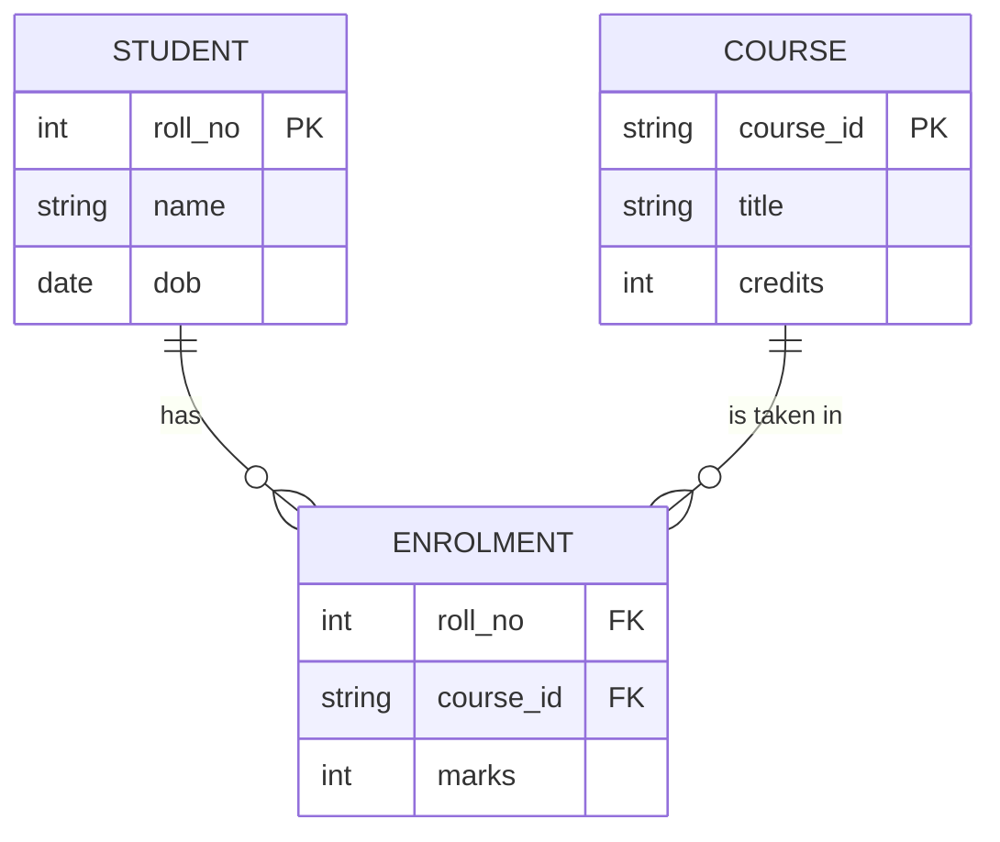

# Unit 2 — The Entity-Relationship Model

**Syllabus topics:** Introduction, the building blocks of an entity
relationship diagram, classification of entity sets, attribute classification,
relationship degree, relationship classification, reducing ER diagrams to
tables, enhanced entity-relationship model (EER model), generalization and
specialization, IS-A relationship and attribute inheritance, multiple
inheritance, constraints on specialization and generalization, advantages of ER
modeling.

---

## 2.1 What an ER model is for

An ER diagram is a **picture of the data** before any database exists. It is
designed to be shown to non-technical people — a hospital administrator can
check whether "a patient may have many appointments" is right, without knowing
any SQL.

Get the ER diagram wrong and every table you build afterwards is wrong. This is
the cheapest stage at which to catch a design error.

## 2.2 Building blocks

| Symbol | Represents |
|---|---|
| **Rectangle** | Entity set |
| **Double rectangle** | Weak entity set |
| **Ellipse** | Attribute |
| **Double ellipse** | Multivalued attribute |
| **Dashed ellipse** | Derived attribute |
| **Ellipse with underlined name** | Key attribute |
| **Diamond** | Relationship set |
| **Double diamond** | Identifying relationship (for a weak entity) |
| **Line** | Links attributes to entities, entities to relationships |
| **Double line** | Total participation |



## 2.3 Classification of entity sets

| Type | Meaning |
|---|---|
| **Strong entity** | Has its own key attribute. Drawn as a rectangle. |
| **Weak entity** | Has no key of its own; identified only through an owner entity. Drawn as a double rectangle. |

A **weak entity** depends on a strong one. `DEPENDENT` (of an employee) is
weak: two employees may each have a son called Ravi, so "name" does not
identify a dependent. It needs the employee's ID plus a **partial key**
(discriminator), drawn with a dashed underline.

Weak entities always have **total participation** in their identifying
relationship — a dependent cannot exist without an employee.

## 2.4 Classification of attributes

| Type | Meaning | Example |
|---|---|---|
| **Simple (atomic)** | Cannot be divided | `age` |
| **Composite** | Made of parts | `name` → first, middle, last |
| **Single-valued** | One value per entity | `date_of_birth` |
| **Multivalued** | Several values per entity | `phone_numbers` |
| **Derived** | Computed from others | `age`, derived from `dob` |
| **Stored** | Physically held | `dob` |
| **Key** | Uniquely identifies an entity | `roll_no` |
| **Null** | Value unknown or not applicable | a missing `middle_name` |

### Types of key — heavily examined

| Key | Definition |
|---|---|
| **Super key** | Any set of attributes that uniquely identifies a row |
| **Candidate key** | A **minimal** super key — remove any attribute and it stops being unique |
| **Primary key** | The candidate key chosen as the main identifier |
| **Alternate key** | A candidate key not chosen as primary |
| **Composite key** | A key made of two or more attributes |
| **Foreign key** | An attribute referencing the primary key of another table |
| **Surrogate key** | An artificial key with no business meaning (an auto-increment ID) |

Every candidate key is a super key; not every super key is a candidate key.
`{roll_no, name}` is a super key but not a candidate key, because `roll_no`
alone suffices.

## 2.5 Relationships

### Degree — the number of entity sets involved

| Degree | Name | Example |
|---|---|---|
| 1 | **Unary / recursive** | An employee *manages* another employee |
| 2 | **Binary** | A student *enrols in* a course — by far the commonest |
| 3 | **Ternary** | A supplier *supplies* a part *for* a project |
| n | **n-ary** | Rare |

The `manager_id` column in the Employee lab table is a **unary recursive**
relationship — it references the same table's own primary key.

### Cardinality — how many of each side

| Ratio | Meaning | Example |
|---|---|---|
| **1:1** | One to one | Employee ↔ ParkingSpace |
| **1:N** | One to many | Department → Employees |
| **M:N** | Many to many | Students ↔ Courses |

### Participation constraints

| Type | Meaning | Notation |
|---|---|---|
| **Total** (mandatory) | Every entity must participate | Double line |
| **Partial** (optional) | Participation is optional | Single line |

"Every loan must belong to a customer" is total participation for LOAN. "Not
every customer has a loan" is partial participation for CUSTOMER.

## 2.6 Reducing an ER diagram to tables

**This is the most examined topic in the unit.** Learn the rules and apply them
mechanically.

### Rule 1 — Strong entity

Becomes a table. Its simple attributes become columns; its key becomes the
primary key.

```sql
STUDENT(roll_no PK, name, dob)
```

### Rule 2 — Weak entity

Becomes a table containing its own attributes **plus the owner's primary key as
a foreign key**. The primary key is the combination of the owner's key and the
partial key.

```sql
DEPENDENT(emp_id FK, dep_name, relationship, PRIMARY KEY(emp_id, dep_name))
```

### Rule 3 — 1:1 relationship

Add the primary key of either side to the other as a foreign key. **Prefer the
side with total participation**, to avoid nulls.

```sql
EMPLOYEE(emp_id PK, name, space_id FK)
```

### Rule 4 — 1:N relationship

Add the primary key of the **"one"** side to the **"many"** side as a foreign
key. Never the other way round.

```sql
DEPARTMENT(dept_id PK, dept_name)
EMPLOYEE(emp_id PK, name, dept_id FK)      -- dept_id goes in EMPLOYEE
```

Putting `emp_id` in DEPARTMENT would allow only one employee per department.

### Rule 5 — M:N relationship

**Always creates a new table.** Its primary key is the combination of both
foreign keys.

```sql
STUDENT(roll_no PK, name)
COURSE(course_id PK, title)
ENROLMENT(roll_no FK, course_id FK, marks, PRIMARY KEY(roll_no, course_id))
```

This is why the Employee lab has an `Employee_Project` table — an employee
works on many projects, and a project has many employees.

**A many-to-many relationship can never be represented without a third table.**
That statement alone earns marks.

### Rule 6 — Multivalued attribute

Becomes its own table, with the owner's key as a foreign key.

```sql
EMPLOYEE(emp_id PK, name)
EMP_PHONE(emp_id FK, phone_number, PRIMARY KEY(emp_id, phone_number))
```

### Rule 7 — Composite attribute

Store the **component parts** as separate columns; drop the composite name.

```sql
-- name(first, middle, last)  becomes:
STUDENT(roll_no PK, first_name, middle_name, last_name)
```

### Rule 8 — Derived attribute

**Do not store it.** Compute it when needed. Storing `age` guarantees it will
be wrong within a year; store `dob` and calculate.

### Rule 9 — n-ary relationship

Create a table with the primary keys of all participating entities as foreign
keys.

## 2.7 The Enhanced ER (EER) model

The EER model adds three concepts to the basic ER model.

### Specialization

**Top-down.** Start with a general entity and identify subgroups that have
distinguishing attributes.

```
              EMPLOYEE
                 │
              ╱ IS-A ╲
             ╱        ╲
      SECRETARY    ENGINEER
      (typing_speed) (specialisation)
```

### Generalization

**Bottom-up.** Notice that several entities share attributes, and factor the
common ones into a superclass.

CAR and TRUCK both have registration number, model and price → generalize into
VEHICLE.

**Specialization and generalization are the same relationship viewed from
opposite directions.** That is a standard two-mark question.

### The IS-A relationship and attribute inheritance

A subclass **IS-A** superclass: an Engineer *is an* Employee. Drawn as a
triangle labelled "IS-A".

**Attribute inheritance:** a subclass inherits every attribute and relationship
of its superclass. ENGINEER automatically has `emp_id`, `name` and `salary`
without redeclaring them, and adds only what is specific to engineers.

### Multiple inheritance

A subclass with **more than one** superclass. An `ENGINEERING_MANAGER` inherits
from both `ENGINEER` and `MANAGER`. The result is a **lattice** rather than a
tree.

Where the superclasses share an inherited attribute, it is inherited only once.

## 2.8 Constraints on specialization and generalization

Two independent dimensions, so four combinations — a favourite exam table.

### Disjointness constraint

| Constraint | Meaning | Notation |
|---|---|---|
| **Disjoint (d)** | An entity may belong to **at most one** subclass | `d` in the circle |
| **Overlapping (o)** | An entity may belong to **several** subclasses | `o` in the circle |

*Disjoint:* a vehicle is a car **or** a truck, not both.
*Overlapping:* a person at a university may be **both** a student and an
employee.

### Completeness constraint

| Constraint | Meaning | Notation |
|---|---|---|
| **Total** | Every superclass entity **must** belong to some subclass | Double line |
| **Partial** | An entity may belong to no subclass | Single line |

*Total:* every employee is either salaried or hourly.
*Partial:* an employee may be neither a secretary nor an engineer.

### The four combinations

| | Disjoint | Overlapping |
|---|---|---|
| **Total** | Every entity in exactly one subclass | Every entity in one or more |
| **Partial** | Every entity in at most one subclass | Any number, including none |

## 2.9 Advantages of ER modelling

1. **Simple and easy to understand** — usable with non-technical stakeholders
2. **Effective communication tool** between designers and users
3. **Maps directly to relational tables** by the rules in §2.6
4. **Design errors are caught early**, on paper rather than in production
5. **Database-independent** — the same diagram works for any relational DBMS
6. **Integrates easily** with other design methods

### Limitations, worth mentioning for a complete answer

1. No standard notation — Chen, Crow's Foot and UML all differ
2. No way to express general constraints ("salary must not exceed the
   manager's")
3. Loses clarity for very large schemas
4. Represents structure only, not behaviour or process

---

## Worked example — designing a library database

**Requirements.** A library has books, each written by one or more authors. A
member may borrow many books; a book may be borrowed by many members over time.
Each loan records an issue date and a due date. Members belong to one of two
categories, student or faculty, with different borrowing limits.

**Entities.** BOOK, AUTHOR, MEMBER
**Relationships.** WRITTEN_BY (M:N), BORROWS (M:N with attributes)
**Specialization.** MEMBER → STUDENT, FACULTY — disjoint and total

**Reduced to tables:**

```sql
BOOK(isbn PK, title, publisher, year)
AUTHOR(author_id PK, name)
WRITTEN_BY(isbn FK, author_id FK, PRIMARY KEY(isbn, author_id))   -- M:N
MEMBER(member_id PK, name, address, join_date)
STUDENT(member_id PK FK, roll_no, department)                     -- IS-A
FACULTY(member_id PK FK, employee_id, designation)                -- IS-A
BORROWS(member_id FK, isbn FK, issue_date,
        due_date, return_date, PRIMARY KEY(member_id, isbn, issue_date))
```

Note that `BORROWS` needs `issue_date` in its primary key — the same member may
borrow the same book more than once over time.

---

## Exam questions from this unit

**Two marks**

1. Distinguish a strong from a weak entity.
2. Define a candidate key and a primary key.
3. What is a derived attribute? Should it be stored?
4. Define the degree of a relationship.
5. Distinguish specialization from generalization.

**Five marks**

1. Explain the classification of attributes with examples.
2. Explain the rules for reducing an ER diagram to tables.
3. Explain the constraints on specialization and generalization.
4. Explain cardinality and participation constraints with examples.

**Ten marks**

1. Draw an ER diagram for a hospital (or university, or library) database, and
   reduce it to relational tables.
2. Explain the EER model — generalization, specialization, IS-A, attribute
   inheritance and multiple inheritance — with a diagram.

## Mistakes that cost marks

- Putting the foreign key on the wrong side of a 1:N relationship (it goes on
  the **many** side)
- Trying to represent an M:N relationship without a third table
- Storing a derived attribute
- Storing a multivalued attribute as a comma-separated column
- Forgetting the partial key of a weak entity
- Drawing an entity as a diamond or a relationship as a rectangle
- Omitting cardinality ratios and participation from the diagram
